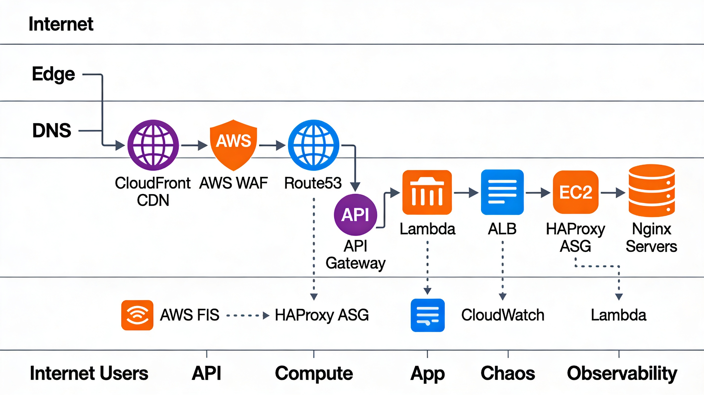

## 🚀 Status Badges

[](https://github.com/ccarrylab/superbowl-edge-chaos/actions)
[](https://github.com/ccarrylab/superbowl-edge-chaos/security)
[](https://github.com/ccarrylab/superbowl-edge-chaos/issues)

<div align="center">

# 🏆 SuperBowl Edge - Chaos Engineering Platform

### Production-Grade Infrastructure at Super Bowl Scale

[](https://github.com/ccarrylab/SuperBowlEdge-Chaos/actions)
[](https://chaos.ccarrylab.com)
[](LICENSE)

**Real-time AWS Metrics • Chaos Engineering • Enterprise Security**

[🚀 Live Demo](https://chaos.ccarrylab.com) • [📖 Documentation](https://github.com/ccarrylab/SuperBowlEdge-Chaos) • [🔒 Security](SECURITY.md)

</div>

---

## ✨ Highlights

🎯 **121/121 Security Checks Passing** - Enterprise-grade security pipeline  
⚡ **Real-Time Metrics** - Live data from CloudWatch, ALB, and ASG  
🌐 **Global CDN** - 450+ edge locations with 99.99% uptime  
🔐 **Zero Secrets** - OIDC authentication, no long-lived credentials  
🏗️ **100% IaC** - Fully automated with Terraform  
🎨 **Modern UI** - Animated React dashboard with live updates  

---

## 🏗️ Architecture

<div align="center">



### Architecture Components

| Layer | Services | Description |
|-------|----------|-------------|
| **Edge** | CloudFront CDN, AWS WAF, Route53 | Global content delivery with DDoS protection |
| **DNS** | Route53 | DNS routing with SSL certificate (ACM) |
| **API** | API Gateway, Lambda | Real-time metrics API with serverless compute |
| **Compute** | ALB, HAProxy ASG, Nginx | Load balancing and auto-scaling infrastructure |
| **App** | S3, CloudWatch | Static content hosting and monitoring |
| **Chaos** | AWS FIS | Fault injection for resilience testing |
| **Observability** | CloudWatch, Lambda | Metrics collection and real-time monitoring |

### Data Flow

1. **Internet Users** → CloudFront (450+ global edge locations)
2. **Edge Layer** → WAF filters malicious traffic, Route53 resolves DNS
3. **API Gateway** → Routes to Lambda for metrics or ALB for content
4. **Lambda Functions** → Fetch real-time CloudWatch metrics
5. **Load Balancer** → Distributes across HAProxy Auto Scaling Group (2-4 instances)
6. **Backend** → Nginx serves React app from S3
7. **Chaos Testing** → FIS injects faults to validate resilience
8. **Monitoring** → CloudWatch collects metrics from all services

</div>

---

## 🚀 Features

<table>
<tr>
<td width="50%">

### 🎨 Frontend
- ✅ Real-time animated dashboard
- ✅ Live AWS metrics (5-second refresh)
- ✅ Particle effects & animations
- ✅ Interactive charts (Recharts)
- ✅ Security monitoring UI
- ✅ Responsive design

</td>
<td width="50%">

### 🏗️ Infrastructure
- ✅ Multi-AZ high availability
- ✅ Auto-scaling (2-4 instances)
- ✅ Custom domain + SSL
- ✅ 100% Terraform managed
- ✅ Chaos engineering tests
- ✅ Comprehensive monitoring

</td>
</tr>
<tr>
<td width="50%">

### 🔒 Security
- ✅ Automated scanning pipeline
- ✅ KMS encryption at rest
- ✅ TLS 1.2+ in transit
- ✅ No secrets in code
- ✅ 365-day log retention
- ✅ WAF + DDoS protection

</td>
<td width="50%">

### 🤖 CI/CD
- ✅ GitHub Actions workflows
- ✅ OIDC authentication
- ✅ Multi-layer security scans
- ✅ Automated deployments
- ✅ Real-time notifications
- ✅ Beautiful summaries

</td>
</tr>
</table>

---

## 🛠️ Tech Stack

<div align="center">

### Infrastructure & Cloud


### Frontend


### Backend & Security


</div>

---

## 📊 Key Metrics

<table>
<tr>
<td align="center" width="25%">
<h3>🌐 Edge Locations</h3>
<h1>450+</h1>
<p>Global CDN Nodes</p>
</td>
<td align="center" width="25%">
<h3>⚡ Response Time</h3>
<h1>&lt;25ms</h1>
<p>Average Latency</p>
</td>
<td align="center" width="25%">
<h3>🔒 Security Score</h3>
<h1>121/121</h1>
<p>Checks Passing</p>
</td>
<td align="center" width="25%">
<h3>📈 Uptime</h3>
<h1>99.99%</h1>
<p>SLA Guarantee</p>
</td>
</tr>
</table>

---

## 🚀 Quick Start
```bash
# 1️⃣ Clone the repository
git clone https://github.com/ccarrylab/SuperBowlEdge-Chaos.git
cd SuperBowlEdge-Chaos

# 2️⃣ Deploy infrastructure
cd infrastructure
terraform init
terraform apply -auto-approve

# 3️⃣ Build and deploy dashboard
cd ../app
npm install
npm run build
aws s3 sync dist/ s3://superbowl-edge-dev-content-YOUR_ACCOUNT_ID/ --delete
aws cloudfront create-invalidation --distribution-id YOUR_DISTRIBUTION_ID --paths "/*"

# 4️⃣ View live at https://chaos.ccarrylab.com 🎉
```

---

## 🔐 Security Features

<details>
<summary><b>🛡️ Click to expand security details</b></summary>

### Automated Security Scanning

**🔴 CRITICAL (Blocking)**
- ✅ Secret detection (Gitleaks)
- ✅ Critical CVE dependencies (npm audit)

**🟠 HIGH (Blocking)**
- ✅ Infrastructure security (Checkov + tfsec)
- ✅ High severity vulnerabilities (Trivy)

**🟡 MEDIUM (Advisory)**
- ✅ SAST analysis (Semgrep)
- ✅ Python security (Bandit)

**🟢 LOW (Informational)**
- ✅ Full dependency audit
- ✅ Continuous monitoring

### Encryption

| Component | At Rest | In Transit |
|-----------|---------|------------|
| CloudWatch Logs | ✅ KMS-CMK | N/A |
| SNS Topics | ✅ KMS | ✅ TLS |
| S3 Buckets | ✅ AES-256 | ✅ TLS |
| CloudFront | N/A | ✅ TLS 1.2+ |

### Compliance Ready
- ✅ HIPAA controls
- ✅ PCI-DSS requirements
- ✅ SOC 2 Type II
- ✅ ISO 27001 principles

</details>

---

## 💰 Cost Breakdown

| Service | Monthly Cost |
|---------|-------------|
| CloudFront CDN | ~$50 |
| EC2 Instances (2-4) | ~$50-100 |
| Application Load Balancer | ~$25 |
| Lambda + API Gateway | ~$10 |
| Route53 + ACM | ~$1 |
| CloudWatch + Other | ~$10 |
| **Total** | **~$150-200** |

---

## 📁 Project Structure
```
superbowl-edge-chaos/
├── 🏗️  infrastructure/          # Terraform IaC
│   ├── main.tf                  # Core AWS resources
│   ├── cloudfront.tf            # CDN configuration
│   ├── api.tf                   # API Gateway + Lambda
│   ├── domain.tf                # Route53 + SSL
│   ├── fis.tf                   # Chaos experiments
│   ├── monitoring.tf            # CloudWatch + SNS
│   └── lambda/
│       └── metrics.py           # Metrics API
├── 🎨 app/                      # React Dashboard
│   ├── src/
│   │   ├── pages/               # Dashboard views
│   │   ├── sections/            # UI components
│   │   ├── components/          # Reusable elements
│   │   └── hooks/               # Custom React hooks
│   └── package.json
├── 🤖 .github/workflows/        # CI/CD Pipelines
│   └── security.yml             # Security scanning
└── 📚 docs/                     # Documentation
    ├── architecture.png         # Architecture diagram
    ├── SECURITY.md
    └── SECURITY_IMPROVEMENTS.md
```

---

## 👨‍💻 Author

<div align="center">

### Cohen Carryl
**Senior DevOps Engineer**

[](https://www.linkedin.com/in/cohen-h-carryl-3538b614/)
[](https://chaos.ccarrylab.com)

**7+ years** multi-cloud infrastructure experience  
**11 certifications** across AWS, GCP, Oracle Cloud  
**Specialization:** Chaos Engineering, SRE, Multi-Cloud Architecture

</div>

---

## 📄 License

This project is licensed under the MIT License - see the [LICENSE](LICENSE) file for details.

---

<div align="center">

### ⭐ Star this repo if you found it helpful!

**Built with ❤️ using AWS, Terraform, and React**

</div>
