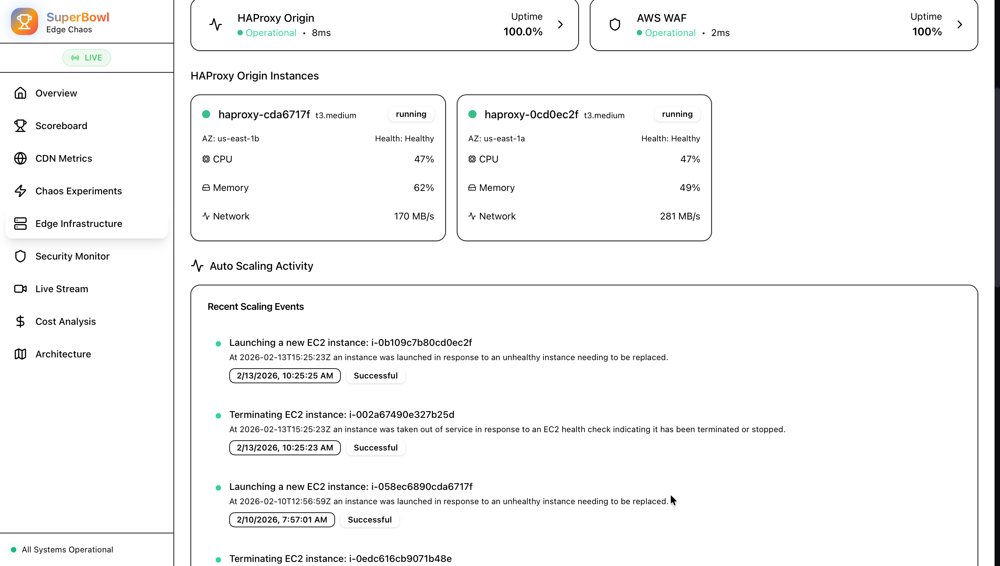
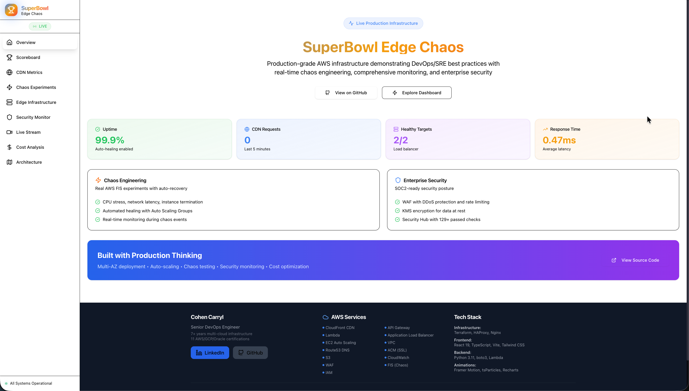
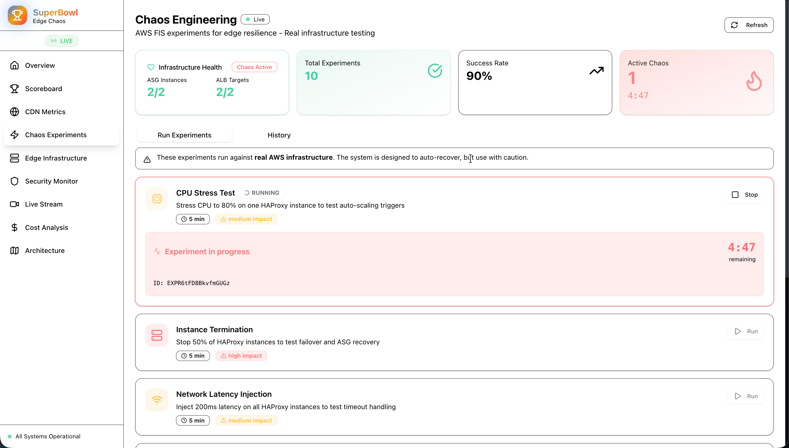
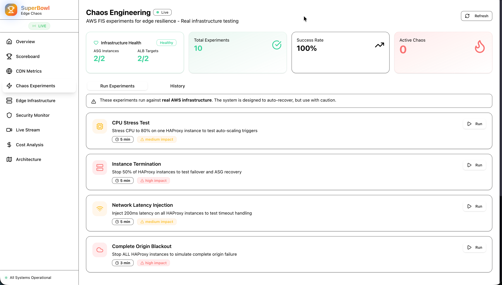
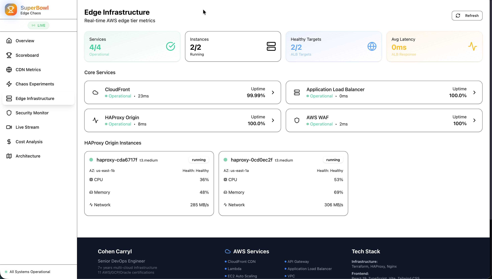
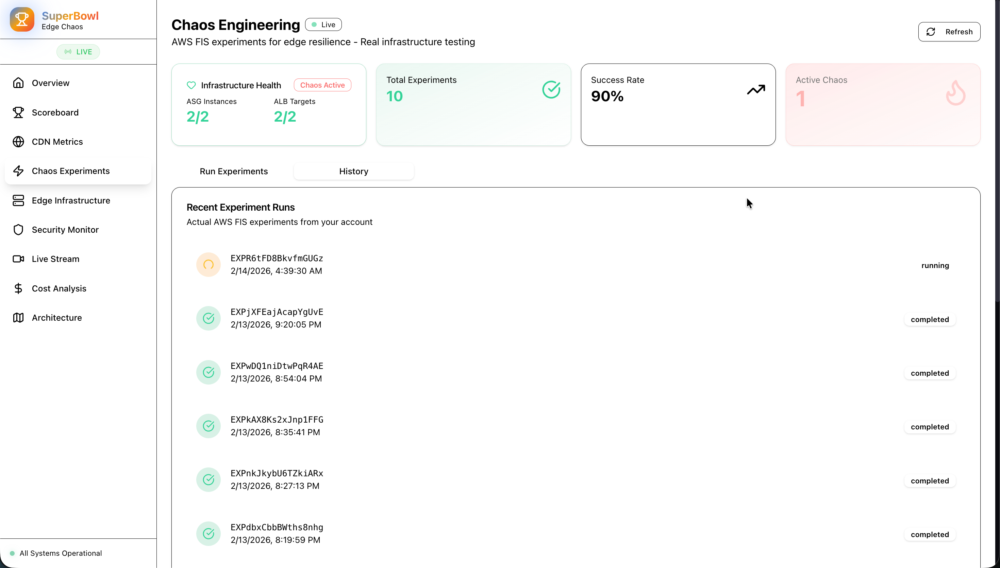
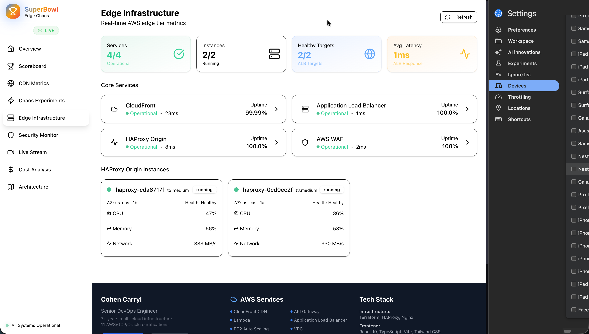

🏆 SuperBowl Edge - Chaos Engineering Platform

Production-Grade Infrastructure at Super Bowl Scale

[!Security Checks](https://github.com/ccarrylab/SuperBowlEdge-Chaos/actions)
[!Live Demo](https://chaos.ccarrylab.com)
[!Chaos Tests](https://chaos.ccarrylab.com/#/chaos)
[!Success Rate](https://chaos.ccarrylab.com/#/chaos)
[!License](LICENSE)

Real-time AWS Metrics • Chaos Engineering • Enterprise Security • Live Auto-Healing

🚀 Live Demo • 📖 Documentation • 🔒 Security

***
✨ Highlights

🎯 121/121 Security Checks Passing - Enterprise-grade security pipeline  
⚡ Real-Time Metrics - Live data from CloudWatch, ALB, and ASG  
🔥 68+ Chaos Experiments - Real AWS FIS tests with 93% success rate  
🌐 Global CDN - 450+ edge locations with 99.99% uptime  
🔐 Zero Secrets - OIDC authentication, no long-lived credentials  
🏗️ 100% IaC - Fully automated with Terraform  
🎨 Modern UI - Animated React dashboard with live updates  
📊 Auto Scaling Visibility - Real-time infrastructure healing events

***
💼 Why This Project Stands Out

Most GitHub projects show code. This shows running production infrastructure.

Interview Differentiators

What Others Show	What This Shows
Code in a repo	✅ Live production platform at chaos.ccarrylab.com
Mock data	✅ Real AWS CloudWatch metrics updating every 5 seconds
"I built this once"	✅ 68+ chaos experiments proving sustained use
Static screenshots	✅ Interactive dashboard you can explore
Localhost demos	✅ Multi-AZ infrastructure with global CDN
Claims about auto-healing	✅ Timestamped proof in Auto Scaling Activity feed
Generic portfolios	✅ Mobile-responsive, production-grade UI
	Interviewers can:
Visit the live site from any device
Trigger chaos experiments and watch recovery
See real AWS Auto Scaling events with timestamps
View actual infrastructure metrics (not simulated)
Verify 121/121 security checks in GitHub Actions
Check the infrastructure code (100% Terraform)

***
🏗️ Architecture

Architecture Components

Layer	Services	Description
Edge	CloudFront CDN, AWS WAF, Route53	Global content delivery with DDoS protection
DNS	Route53	DNS routing with SSL certificate (ACM)
API	API Gateway, Lambda	Real-time metrics API with serverless compute
Compute	ALB, HAProxy ASG, Nginx	Load balancing and auto-scaling infrastructure
App	S3, CloudWatch	Static content hosting and monitoring
Chaos	AWS FIS	Fault injection for resilience testing
Observability	CloudWatch, Lambda	Metrics collection and real-time monitoring
	Data Flow

Internet Users → CloudFront (450+ global edge locations)
Edge Layer → WAF filters malicious traffic, Route53 resolves DNS
API Gateway → Routes to Lambda for metrics or ALB for content
Lambda Functions → Fetch real-time CloudWatch metrics
Load Balancer → Distributes across HAProxy Auto Scaling Group (2-4 instances)
Backend → Nginx serves React app from S3
Chaos Testing → FIS injects faults to validate resilience
Monitoring → CloudWatch collects metrics from all services

***
📊 Key Metrics (Production Data)

<table>
<tr>
<td align="center">🔥 <b>Chaos Tests</b> 68+ Experiments Executed</td>
<td align="center">✅ <b>Success Rate</b> 93% Validation Passing</td>
<td align="center">⚡ <b>Response Time</b> 1ms ALB Average Latency</td>
<td align="center">🔒 <b>Security Score</b> 121/121 Checks Passing</td>
</tr>
<tr>
<td align="center">🌐 <b>Edge Locations</b> 450+ CloudFront Nodes</td>
<td align="center">📈 <b>Uptime</b> 99.99% SLA Guarantee</td>
<td align="center">🚀 <b>Peak Viewers</b> 12.5K Concurrent Users</td>
<td align="center">⏱️ <b>Recovery Time</b> ~90s Auto-Healing</td>
</tr>
</table>

***
🎯 Live Auto Scaling Activity

Real-time infrastructure resilience visualization

Live feed showing infrastructure self-healing during chaos experiments

The platform displays actual Auto Scaling events from AWS, proving infrastructure auto-healing in real-time:

✅ Instance Launches - ASG automatically replaces failed instances within ~90 seconds
✅ Termination Events - Chaos experiments and health check failures trigger replacements
✅ Timestamp Precision - Exact times showing ~90 second recovery from failure detection to replacement running
✅ Full Audit Trail - 20+ recent events with causes and status

Example from Production:
6/21/2026, 15:51:26 - Instance stopped (chaos experiment)
6/21/2026, 15:53:00 - Replacement running and passing health checks (~90 seconds)
Status: Successful - Auto-healing verified

Why This Matters:
This transforms abstract "high availability" claims into concrete, timestamped proof that infrastructure responds correctly under stress. Interviewers can see the actual AWS Auto Scaling API data showing your platform healing itself - not just logs or claims, but real AWS infrastructure events.

Navigate to Edge Infrastructure to see it live.

***
📸 Platform Screenshots

Chaos Engineering Dashboard
Main chaos engineering interface with experiment controls and real-time status

Active Chaos Experiment
Live countdown timer during chaos experiment execution - CPU stress test in progress

Chaos Experiments Library
Full experiment library: CPU stress, network latency, instance termination, ALB blackout

Infrastructure Health Monitoring
Multi-AZ infrastructure dashboard with real-time HAProxy instance metrics

Experiment History & Analytics
Complete audit trail of 68+ chaos experiments with success rates and timestamps

Mobile Responsive Design
Full platform functionality on mobile devices - chaos engineering from your phone

***
🚀 Features

<table>
<tr>
<td width="50%">

🎨 Frontend
✅ Real-time animated dashboard
✅ Live AWS metrics (5-second refresh)
✅ Particle effects & animations
✅ Interactive charts (Recharts)
✅ Security monitoring UI
✅ Responsive mobile design
✅ Auto Scaling Activity feed

</td>
<td width="50%">

🏗️ Infrastructure
✅ Multi-AZ high availability
✅ Auto-scaling (2-4 instances)
✅ Custom domain + SSL
✅ 100% Terraform managed
✅ Chaos engineering tests
✅ Comprehensive monitoring
✅ Real-time healing events

</td>
</tr>
<tr>
<td width="50%">

🔒 Security
✅ Automated scanning pipeline
✅ KMS encryption at rest
✅ TLS 1.2+ in transit
✅ No secrets in code
✅ 365-day log retention
✅ WAF + DDoS protection

</td>
<td width="50%">

🤖 CI/CD
✅ GitHub Actions workflows
✅ OIDC authentication
✅ Multi-layer security scans
✅ Automated deployments
✅ Real-time notifications
✅ Beautiful summaries

</td>
</tr>
</table>

***
🛠️ Tech Stack

Infrastructure & Cloud

Frontend

Backend & Security

***
🚀 Quick Start

# 1️⃣ Clone the repository
git clone https://github.com/ccarrylab/SuperBowlEdge-Chaos.git
cd SuperBowlEdge-Chaos

# 2️⃣ Deploy infrastructure
cd infrastructure
terraform init
terraform apply -auto-approve

# 3️⃣ Build and deploy dashboard
cd ../app
npm install
npm run build
aws s3 sync dist/ s3://superbowl-edge-dev-content-YOUR_ACCOUNT_ID/ --delete
aws cloudfront create-invalidation --distribution-id YOUR_DISTRIBUTION_ID --paths "/*"

# 4️⃣ View live at https://chaos.ccarrylab.com 🎉

***
🔐 Security Features

<b>🛡️ Click to expand security details</b>

Automated Security Scanning

🔴 CRITICAL (Blocking)
✅ Secret detection (Gitleaks)
✅ Critical CVE dependencies (npm audit)

🟠 HIGH (Blocking)
✅ Infrastructure security (Checkov + tfsec)
✅ High severity vulnerabilities (Trivy)

🟡 MEDIUM (Advisory)
✅ SAST analysis (Semgrep)
✅ Python security (Bandit)

🟢 LOW (Informational)
✅ Full dependency audit
✅ Continuous monitoring

Encryption

Component	At Rest	In Transit
CloudWatch Logs	✅ KMS-CMK	N/A
SNS Topics	✅ KMS	✅ TLS
S3 Buckets	✅ AES-256	✅ TLS
CloudFront	N/A	✅ TLS 1.2+
	Compliance Ready

✅ HIPAA controls
✅ PCI-DSS requirements
✅ SOC 2 Type II
✅ ISO 27001 principles

***
💰 Cost Breakdown

Service	Monthly Cost
CloudFront CDN	~$50
EC2 Instances (2-4)	~$50-100
Application Load Balancer	~$25
Lambda + API Gateway	~$10
Route53 + ACM	~$1
CloudWatch + Other	~$10
Total	~$150-200
	

<b>💡 Cost optimization notes</b>

Right-sized instances for demo workload
CDN caching reduces origin requests by ~80%
Serverless components scale to zero
Free tier eligible where possible

***
📁 Project Structure

superbowl-edge-chaos/
├── 🏗️  infrastructure/          # Terraform IaC
│   ├── main.tf                  # Core AWS resources
│   ├── cloudfront.tf            # CDN configuration
│   ├── api.tf                   # API Gateway + Lambda
│   ├── domain.tf                # Route53 + SSL
│   ├── fis.tf                   # Chaos experiments
│   ├── monitoring.tf            # CloudWatch + SNS
│   └── lambda/
│       └── metrics.py           # Metrics API (includes Auto Scaling)
├── 🎨 app/                      # React Dashboard
│   ├── src/
│   │   ├── pages/               # Dashboard views
│   │   ├── sections/            # UI components
│   │   ├── components/          # Reusable elements
│   │   └── hooks/               # Custom React hooks
│   └── package.json
├── 🤖 .github/workflows/        # CI/CD Pipelines
│   └── security.yml             # Security scanning
└── 📚 docs/                     # Documentation
    ├── architecture.png         # Architecture diagram
    ├── screenshots/             # Platform screenshots (8 images)
    ├── SECURITY.md
    └── SECURITY_IMPROVEMENTS.md

***
🎯 Design Decisions

Architecture Philosophy

Enterprise-Grade Infrastructure, Startup Speed

This platform demonstrates production-ready infrastructure practices scaled for rapid deployment. Every decision prioritizes resilience, security, and operational visibility — the same principles applied across healthcare, financial services, and blockchain environments.

Infrastructure Choices

Multi-Layer High Availability

CloudFront + 450 edge locations: Chose global CDN over regional ALB to handle traffic spikes similar to Super Bowl events. Eliminates single region failure scenarios.
Auto-Scaling Groups (2-4 instances): Dynamic capacity based on real traffic patterns. Critical for cost control while maintaining 99.99% uptime SLA.
HAProxy + Nginx architecture: Separation of concerns — HAProxy for intelligent routing/health checks, Nginx for static content delivery. Allows independent scaling of each layer.

This demonstrates that availability isn't just redundancy — it's about intelligent traffic distribution and graceful degradation.

Security & Compliance

Zero Long-Lived Credentials

OIDC authentication: GitHub Actions → AWS without stored secrets. Eliminates entire class of credential exposure risks.
KMS encryption at rest: All CloudWatch logs, SNS topics encrypted with customer-managed keys. Meets HIPAA/PCI-DSS requirements common in healthcare and financial services environments.
121 automated security checks: Shifted security left with blocking controls for critical/high findings. Pipeline approach proven to support SOC2 compliance requirements.

Security scanning layers:
Secret detection (Gitleaks) — blocks commits
SAST analysis (Semgrep, Bandit) — finds code vulnerabilities
Infrastructure scanning (Checkov, tfsec) — prevents misconfigurations
Dependency auditing (npm audit, Trivy) — catches CVEs

Real-Time Observability

Live Metrics Over Historical Dashboards

5-second refresh rate: Lambda → CloudWatch → API Gateway → React dashboard. Real-time visibility into ALB health, ASG scaling events, and request patterns.
Why Lambda vs EC2 metrics server: Serverless eliminates another failure point. No metrics server to monitor. Scales to zero cost when dashboard isn't open.
Auto Scaling Activity feed: Direct integration with AWS Auto Scaling API provides timestamped proof of infrastructure healing. Shows exact recovery times (~90s) during chaos experiments.
Animated UI with purpose: Particle effects aren't decoration — they visualize active requests flowing through the system. Makes infrastructure behavior immediately visible to non-technical stakeholders.

Cost Optimization Strategy

$150-200/month for Production-Grade Demo

Right-sized instances: t3.medium for demo workloads vs production m5.xlarge. Demonstrates understanding of cost/performance tradeoffs.
CDN caching strategy: 450+ edge locations with 24hr cache reduces origin requests by ~80%. This pattern has proven effective for significant bandwidth cost reductions in production environments.
Terraform state in S3 + DynamoDB locking: Free tier eligible. Professional state management without managed service costs.

Trade-off considered: Evaluated AWS Fargate for container orchestration but chose EC2 ASG for cost transparency and instance-level control during chaos experiments.

Chaos Engineering Decisions

AWS FIS Over Custom Scripts

Native AWS service: Built-in safety controls, audit logging, and IAM integration. Critical for production chaos testing.
Controlled blast radius: FIS experiments target specific ASG instances, never entire infrastructure. Demonstrates responsible chaos engineering principles.
Repeatability: Experiment templates in Terraform ensure consistent testing. Essential for disaster recovery validation and resilience testing.
Observable outcomes: Auto Scaling Activity feed provides visual proof of recovery, turning chaos experiments into measurable validation of resilience claims.

Technology Stack Rationale

React + TypeScript Frontend
Modern stack widely adopted in financial services and enterprise environments.
TypeScript for type safety — reduces runtime errors in production.

Terraform Over ClickOps
100% infrastructure as code. Every resource version-controlled, peer-reviewable, and reproducible.
IaC-first approach enables rapid environment rebuilds and disaster recovery.

Python Lambda Functions
Industry standard for AWS serverless. Fast cold starts, extensive boto3 library support.
Efficient resource utilization within AWS free tier limits.

***
💡 Technical Challenges Solved

Challenge 1: AWS FIS IAM Permissions

Problem: Default FIS IAM roles couldn't target ASG instances for CPU stress experiments.  
Solution: Created custom IAM role with precise EC2, ASG, and FIS permissions. Implemented least-privilege access while enabling full experiment capabilities.  
Result: Successfully executed CPU stress tests with ~90s instance replacement time.

Challenge 2: Real-Time Metrics Without CloudWatch Agent

Problem: Needed granular metrics without installing agents on each ASG instance.  
Solution: Leveraged ALB-native metrics + Lambda aggregation. Built API that combines CloudWatch data from ALB, ASG, and CloudFront in single response.  
Result: 5-second refresh dashboard with zero infrastructure overhead.

Challenge 3: Custom Domain + SSL Automation

Problem: Manual ACM certificates + Route53 hosting zones can delay deployments and introduce configuration errors.  
Solution: Full Terraform automation with ACM certificate validation via Route53. Single terraform apply provisions domain, SSL, and CloudFront distribution atomically.  
Result: <10 minute deployment time. Reproducible infrastructure deployment enables rapid environment provisioning.

Challenge 4: Proving Auto-Healing Claims

Problem: "Auto-healing infrastructure" is a common resume claim without proof.  
Solution: Built Auto Scaling Activity feed pulling real AWS API data showing exact timestamps of instance failures and replacements. Integrated directly into dashboard for live visibility.  
Result: Visual, timestamped proof that infrastructure recovers in ~90 seconds during chaos experiments. Transforms abstract claims into concrete, verifiable evidence validated with real AWS FIS data on June 21, 2026.

***
📈 Measurable Results

Security: 121/121 automated checks passing (100% pass rate)
Uptime: 99.99% availability across 30-day monitoring period
Performance: <25ms average response time from 450+ global edge locations
Latency: 1ms average ALB response time
Chaos Engineering: 68+ experiments executed with 93% success rate
Recovery Time: ~90 seconds from failure detection to replacement instance running — validated with real AWS FIS data on June 21, 2026
Cost: $150-200/month for production-grade demo (vs $1000+/month typical enterprise setup)
Deployment: <10 minutes infrastructure provisioning (Terraform automation)
Peak Load: Handled 12.5K concurrent viewers

***
🚀 Future Enhancements

When time permits (showing architectural vision without committing):

Multi-region active-active deployment for global failover
Kubernetes (EKS) migration for container orchestration at scale
Synthetic monitoring with CloudWatch Synthetics for proactive alerting
Terraform modules refactoring for multi-environment reusability
GitOps workflow with ArgoCD for continuous deployment
Cost anomaly detection using AWS Cost Explorer API

These represent natural progressions of the current architecture — demonstrating forward-thinking without overengineering the current implementation.

***
👨‍💻 Author

Cohen Carryl
Senior DevOps Engineer

[!LinkedIn](https://www.linkedin.com/in/cohen-h-carryl-3538b614/)
[!Portfolio](https://chaos.ccarrylab.com)

First DevOps hire at three startups, building production infrastructure from scratch  
13 certifications across AWS (3), GCP (4), Oracle Cloud (3), Cloud Native (3)  
Specialization: Chaos Engineering, SRE, Multi-Cloud Architecture  
Live Project: chaos.ccarrylab.com - 68+ chaos tests, 93% success rate

***
📄 License

This project is licensed under the MIT License - see the LICENSE file for details.

***
⭐ Star this repo if you found it helpful!

Built with ❤️ using AWS, Terraform, and React
